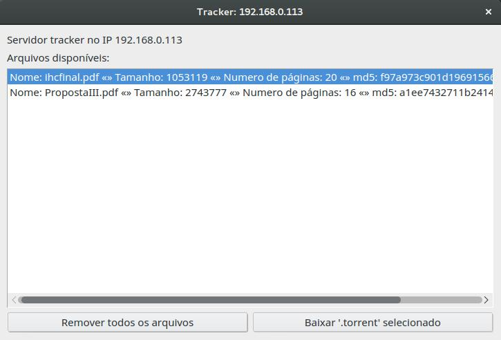
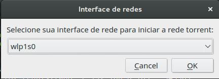
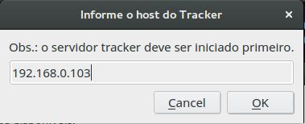
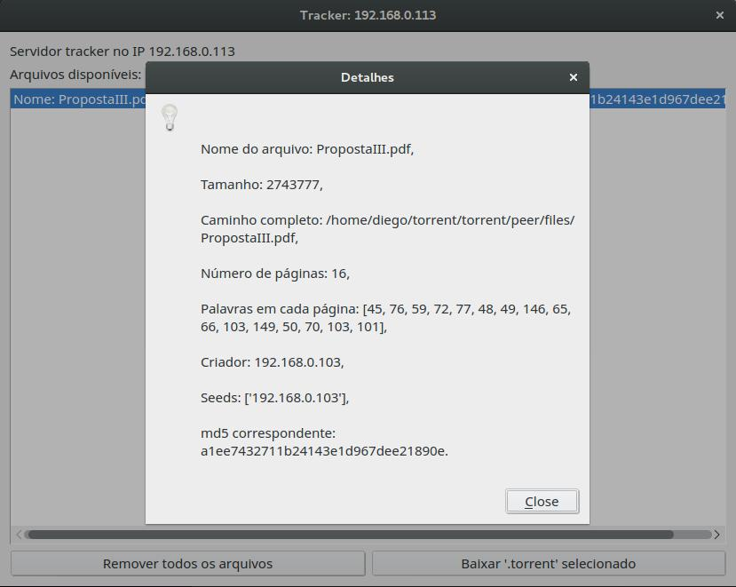

# pyTorrent

Protótipo de rede P2P Torrent escrito em Python baseado em sockets puros.

## 1. Da inicialização

1.1. A arquitetura segue o proposto solicitado pelo professor da disciplina, onde os clientes (<b>peers</b>) são conectados ao servidor <b>tracker</b>. O servidor <b>tracker</b> armazena, em tempo de memória, todos os arquivos disponíveis na rede, como sugere a imagem abaixo:



1.2. Para iniciar o ambiente basta abrir um terminal e fazer os seguintes passos:
> 1º ```cd torrent```<br>
> 2º ```source bin/activate```<br>
> 3º ```cd torrent/peer```

1.3. O servidor <b>tracker</b> DEVE ser inicializado antes dos demais <b>peers</b> com o comando ```python tracker.py```. Informe a interface de rede e o IP referente a esta maquina. Se a conexão for cabeada ou por máquina virtual, escolha a interface ```eth0``` e logo após apenas confirme o IP que a aplicação detectou.



1.4. Os demais clientes <b>peers</b> podem ser inicializados nas outras máquinas através do comando ```python peer.py```. Assim como o <b>tracker</b>, o <b>peer</b> também necessita da interface e IP correspondente. A mesma informação do item 1.3 vale para este caso.

O próximo passo é apontar o cliente <b>peer</b> para o <b>tracker</b> específico informando o IP relativo ao <b>tracker</b>, conforme a imagem abaixo:



<b>SE VOCÊ CHEGOU ATÉ AQUI, SUA REDE P2P ESTÁ PRONTA \o/</b>, vamos para o passo seguinte.

## 2. Do funcionamento

2.1. O primeiro passo desta operação é adicionar um novo arquivo na rede torrent através de um <b>peer</b> qualquer. Na aba "Meus arquivos" vá em "Adicionar arquivo" e selecione alguma mídia no formato <b>PDF</b>.

Ao disponibilizar um novo arquivo, este vai aparecer automaicamente na listagem do <b>tracker</b> - um clique duplo sobre o item exibirá informações detalhadas sobre número de palavras por página, hosts que contém a mídia e etc.



2.2. Ainda no <b>tracker</b>, existe a possibilidade de gerar arquivos ".torrent" das mídias contidas na listagem através do botão "baixar .torrent selecionado"

2.3. A aba "Buscar arquivos na rede" realiza pesquisas, tanto por <i>string</i>, como por arquivo ".torrent". Ao clicar no botão "Pesquisar", os seguintes procedimentos acontecem:

<ol>
  <li><b>Peer</b> faz ao requisição ao <b>tracker</b> a procura de arquivos com nome similar ao do campo de busca.</li>
  <li><b>Tracker</b> retorna uma lista com o resultado.</li>
</ol>

2.4. Com o arquivo já selecionado para baixar, o <b>peer</b> verifica quais hosts que contemplam o arquivo estão ativos fazendo uma requisição ```nmap``` para cada um deles. Com o ```nmap``` é possível também obter a latência de momento. O <b>peer</b> então realiza um "ranking" os hosts em razão da menor latência e define quais páginas PDF vai pedir para cada host.

2.5. O cálculo da obtenção de páginas PDF para cada host segue a seguinte abordagem em passos:

<i>Se houver 2 hosts com o mesmo arquivo:</i>

<ol>
  <li>100% do arquivo para 2.</li>
  <li>50% - host 1, 50% host 2.</li>
  <li><b>Resultado</b>: 75% - host 1, 25% host 2.</li>
</ol>

<i>Se houver 3 hosts com o mesmo arquivo:</i>

<ol>
  <li>100% do arquivo para 3.</li>
  <li>33,33% - host 1, 33,33% host 2, 33,33% host 3.</li>
  <li><b>Resultado</b>: 58,3275% - host 1, 24,9975% host 2, 16,665% host 3.</li>
</ol>

2.6. Após as partes de cada host serem baixadas, o host requerente junta os arquivos PDF na órdem e iguala o hash ```md5``` do arquivo buscado com o recém-baixado.

2.7. Se o ```md5``` estiver <b>OK</b>, o <b>peer</b> requerente "avisa" ao <b>tracker</b> que agora também esta disponibilizando este arquivo. Com isso, o <b>tracker</b> adiciona o IP do requerente à lista de hosts que tem o arquivo.

## 3. Das tecnologias

<center>

|                 Função                 |                   Tecnologia                 |
|:--------------------------------------:|:--------------------------------------------:|
|          Linguagem principal           |                   Python 3.4.3               |
|          Framework para GUI            |                    Qt (PyQt4)                |
|             Comunicação                |    Protocolo próprio usando JSON e sockets   |
|               Outros                   |                   NMAP e PyPDF               |

</center>

## 4. Dos desafios

<ul>
  <li>Criação de interfaces com paralelismo e manipulação de sinais entre <b>peer</b> e <b>tracker</b>.</li>
  <li>Manipulação do PDF e criação do algoritmo de download prioritário para ativos com menor latência.</li>
  <li>Atualização em tempo real sobre o status das operações na rede.</li>
  <li>Método de identificação automática de IP's.</li>
  <li>Scanneamento de portas ativas para impedir possíveis erros.</li>
  <li>Preparação de ambiente (todas as máquinas tiveram de ser virtualizadas para a versão específica do Ubuntu (14.04).</li>
</ul>
